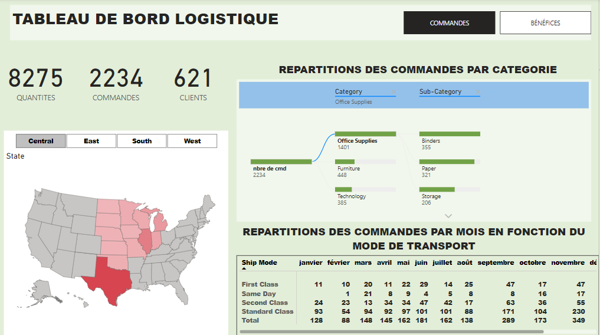
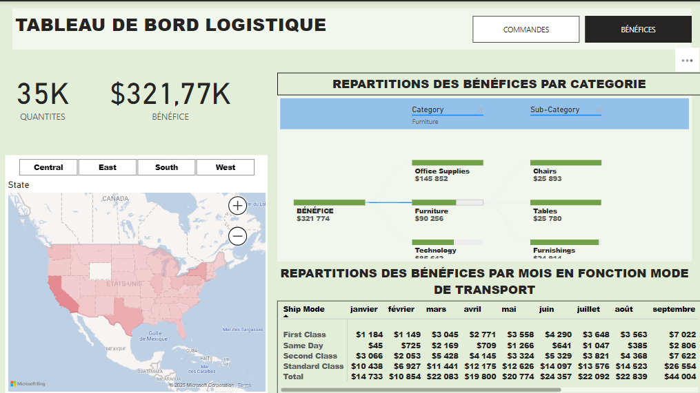

# Logistic Dashboard 

This project involves the creation of a comprehensive Power BI dashboard to analyze logistics performance, featuring insights on orders and profits. The dashboard provided key indicators, geographic visualizations, Sankey diagrams for category-level analysis, and detailed monthly trends by transportation mode, enabling data-driven decision-making for operational and financial optimization.

*Orders Dashboard Page*

*Profits Dashboard Page*
